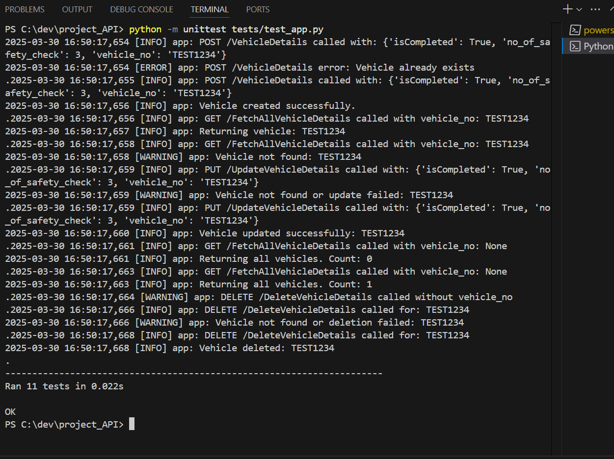
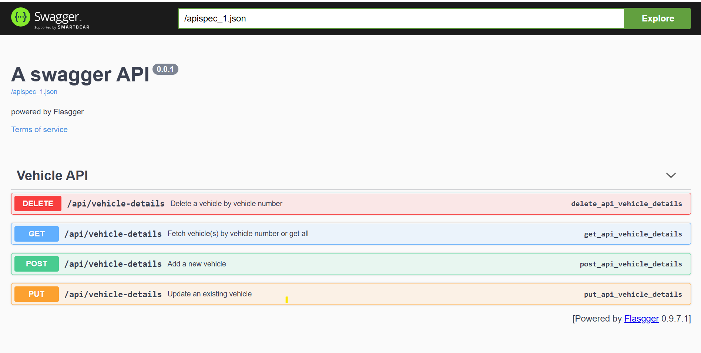

# Vehicle Safety Check API

This is the **backend API** for the Vehicle Safety Check application, built using Python and Flask. It provides RESTful endpoints to perform Create, Read, Update, and Delete (CRUD) operations on vehicle safety records.

Looking for the frontend? Check out the [Flutter app here](https://github.com/alexraajan/vehicle-safety-check-flutter)

---

Features

- Add new vehicle safety records
- Fetch a single or all vehicle records
- Update vehicle safety check status
- Delete vehicle records
- Swagger documentation (Auto-generated)
  Unit tests with `unittest`
- MSSQL Database integration
- Dependency Injection (for clean architecture)

---

Tech Stack

- Python 3.11+
- Flask
- SQL Server (MSSQL)
- PyODBC
- Flasgger (Swagger UI)
- unittest

---

Project Structure

```plaintext
project_API/
├── app.py                  # Main Flask application
├── businessLayer.py        # Business logic layer
├── databaseLayer.py        # Database operations layer
├── entity.py               # Entity class for Vehicle
├── env_parameters.json     # Environment configuration
├── tests/
│   └── test_app.py         # Unit tests for all endpoints

---

### Unit Testing


python -m unittest tests/test_app.py
Sample test coverage includes:
test_1_post_vehicle_success
test_1_post_vehicle_conflict
test_2_get_specific_vehicle_found
test_2_get_specific_vehicle_not_found
test_3_update_vehicle_success
test_3_update_vehicle_fail
test_4_get_all_vehicles_success
test_4_get_all_vehicles_empty
test_5_delete_vehicle_success
test_5_delete_vehicle_not_found
test_5_delete_vehicle_missing_param




Setup Instructions
1) Clone the repository:
                      git clone https://github.com/alexraajan/vehicle-safety-check-api.git
                      cd vehicle-safety-check-api
2) Install dependencies:
                        pip install python-dotenv
                        pip install flask 
                        pip install pyodbc 
                        pip install flasgger 
                        pip install pytest
                        pip install flask-cors
3) Configure the database in env_parameters.json:
                                    {
                                      "environment": "dev",
                                      "dev": {
                                        "DbConnectionString": "DRIVER={ODBC Driver 17 for SQL Server};SERVER=ALEX_LENOVO\\SQLEXPRESS;DATABASE=ProjectSG;Trusted_Connection=yes"
                                      }
                                    }
4) Run the app: python app.py

Database Setup
CREATE DATABASE ProjectSG;
USE ProjectSG;

CREATE TABLE VehicleDetails (
  vehicle_no VARCHAR(10) PRIMARY KEY,
  no_of_safety_check INT,
  isCompleted TINYINT
);

API Endpoints
All endpoints are documented via Swagger UI at: http://localhost:5000/apidocs

POST    /api/vehicle-details    Add a new vehicle
GET 	  /api/vehicle-details	  Get all / specific vehicle
PUT 	  /api/vehicle-details    Update vehicle info
DELETE	/api/vehicle-details	  Delete a vehicle
Swagger UI Screenshot:





Architecture Notes
This project follows a layered architecture with dependency injection for the database connection:
connection_string = get_db_connection_string()
db_context = DatabaseContext(connection_string)
vehicle_repo = VehicleRepository(db_context)
vehicle_service = VehicleService(vehicle_repo)

Additional Screenshots


